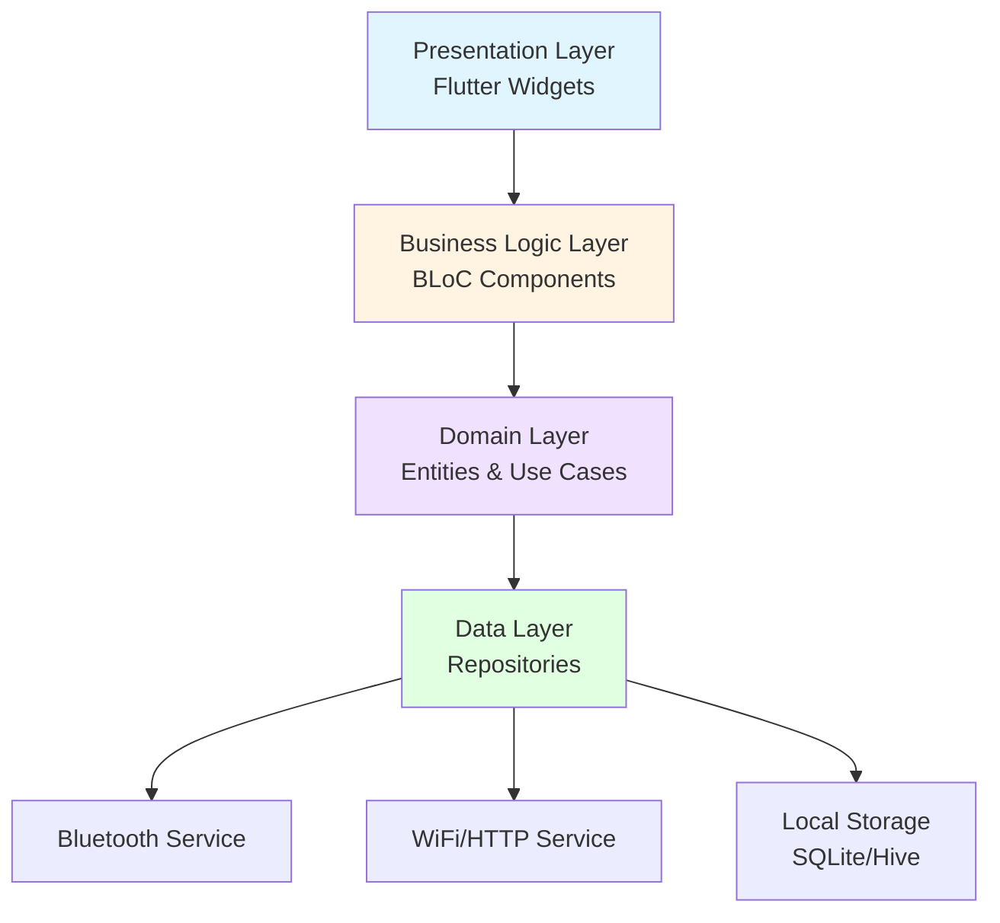

# Design Document: Grill Controller App

## Overview

The Grill Controller App is a Flutter-based cross-platform application that provides real-time monitoring and control of wifi-connected charcoal grill fan systems. The architecture follows a clean architecture pattern with clear separation between presentation, business logic, and data layers. The app uses BLoC (Business Logic Component) pattern for state management, ensuring reactive UI updates and testable business logic.

Key design principles:
- Reactive programming with streams for real-time temperature updates
- Platform-agnostic core logic with platform-specific adapters
- Offline-first architecture with local data persistence
- Modular design supporting multiple device types and protocols

## Architecture

### High-Level Architecture



### Layer Responsibilities

**Presentation Layer:**
- Flutter widgets and screens
- Responsive layouts for phone, tablet, desktop
- User input handling
- Visual feedback and animations

**Business Logic Layer (BLoC):**
- State management using flutter_bloc
- Event handling and state transitions
- Coordination between domain use cases
- Stream-based reactive updates

**Domain Layer:**
- Core business entities (Device, Probe, CookProgram, etc.)
- Use cases (ConnectDevice, MonitorTemperature, ControlFan, etc.)
- Business rules and validation
- Platform-agnostic logic

**Data Layer:**
- Repository implementations
- Protocol adapters (iKamand HTTP, Bluetooth)
- Local storage management
- Network communication

## Components and Interfaces

### Core Domain Entities

```dart
// Temperature reading with timestamp
class TemperatureReading {
  final String probeId;
  final double temperature;  // Fahrenheit
  final DateTime timestamp;
  final ProbeType type;
}

enum ProbeType { grill, food1, food2, food3 }

// Device representation
class GrillDevice {
  final String id;
  final String name;
  final DeviceType type;
  final ConnectionStatus status;
  final List<Probe> probes;
  final FanStatus fanStatus;
}

enum DeviceType { ikamand, unknown }
enum ConnectionStatus { disconnected, bluetooth, wifi }

// Probe configuration
class Probe {
  final String id;
  final ProbeType type;
  final bool isActive;
  final double? targetTemperature;
}

// Fan control
class FanStatus {
  final int speed;  // 0-100 percentage
  final bool isAutomatic;
  final DateTime lastUpdate;
}

// Cook program
class CookProgram {
  final String id;
  final String name;
  final List<CookStage> stages;
  final CookProgramStatus status;
}

class CookStage {
  final double targetTemperature;
  final Duration duration;
  final bool alertOnComplete;
}

enum CookProgramStatus { idle, running, paused, completed }

// Cook session
class CookSession {
  final String id;
  final DateTime startTime;
  final DateTime? endTime;
  final String deviceId;
  final List<TemperatureReading> readings;
  final String? notes;
  final CookProgram? program;
}
```

### Key Interfaces

```dart
// Device communication
abstract class DeviceRepository {
  Stream<GrillDevice> watchDevice(String deviceId);
  Future<void> connectBluetooth(String deviceId);
  Future<void> sendWifiCredentials(String deviceId, String ssid, String password);
  Future<void> setFanSpeed(String deviceId, int speed);
  Future<List<GrillDevice>> discoverDevices();
}

// Temperature monitoring
abstract class TemperatureRepository {
  Stream<TemperatureReading> watchTemperatures(String deviceId);
  Future<List<TemperatureReading>> getHistory(String deviceId, DateTime start, DateTime end);
  Future<void> saveReading(TemperatureReading reading);
}

// Cook session management
abstract class CookSessionRepository {
  Future<CookSession> createSession(String deviceId);
  Future<void> endSession(String sessionId, String? notes);
  Future<CookSession> getSession(String sessionId);
  Future<List<CookSession>> getAllSessions();
  Stream<CookSession> watchSession(String sessionId);
}

// Cook program management
abstract class CookProgramRepository {
  Future<void> saveProgram(CookProgram program);
  Future<CookProgram> getProgram(String programId);
  Future<List<CookProgram>> getAllPrograms();
  Future<void> deleteProgram(String programId);
}
```

### BLoC Components

```dart
// Device connection BLoC
class DeviceConnectionBloc extends Bloc<DeviceConnectionEvent, DeviceConnectionState> {
  // Events: StartDiscovery, ConnectBluetooth, SendWifiCredentials, Disconnect
  // States: Discovering, BluetoothConnected, WifiConnected, Disconnected, Error
}

// Temperature monitoring BLoC
class TemperatureMonitorBloc extends Bloc<TemperatureMonitorEvent, TemperatureMonitorState> {
  // Events: StartMonitoring, StopMonitoring, UpdateReading
  // States: Monitoring, Idle, Error
  // Emits real-time temperature updates
}

// Fan control BLoC
class FanControlBloc extends Bloc<FanControlEvent, FanControlState> {
  // Events: SetTargetTemperature, SetManualSpeed, EnableAutomatic, DisableAutomatic
  // States: Automatic, Manual, GrillOpen, Error
  // Implements fan speed calculation algorithm
}

// Cook program BLoC
class CookProgramBloc extends Bloc<CookProgramEvent, CookProgramState> {
  // Events: StartProgram, PauseProgram, ResumeProgram, StopProgram, StageComplete
  // States: Idle, Running, Paused, Completed
}

// Grill-open detection BLoC
class GrillOpenDetectionBloc extends Bloc<GrillOpenEvent, GrillOpenState> {
  // Events: TemperatureUpdate, ManualResume
  // States: Closed, Open, Resuming
  // Monitors temperature drops and manages fan pause/resume
}
```

## Data Models

### Local Storage Schema

Using Hive for lightweight local storage:

```dart
// Hive box: 'devices'
@HiveType(typeId: 0)
class DeviceModel {
  @HiveField(0) String id;
  @HiveField(1) String name;
  @HiveField(2) String type;
  @HiveField(3) String? lastKnownIp;
  @HiveField(4) Map<String, dynamic>? configuration;
}

// Hive box: 'cook_sessions'
@HiveType(typeId: 1)
class CookSessionModel {
  @HiveField(0) String id;
  @HiveField(1) DateTime startTime;
  @HiveField(2) DateTime? endTime;
  @HiveField(3) String deviceId;
  @HiveField(4) String? notes;
  @HiveField(5) String? programId;
}

// SQLite for temperature readings (better for time-series data)
// Table: temperature_readings
// Columns: id, session_id, probe_id, temperature, timestamp, probe_type
```

### Device Protocol Models

```dart
// iKamand HTTP protocol
class IKamandStatus {
  final double grillTemp;
  final double? food1Temp;
  final double? food2Temp;
  final double? food3Temp;
  final int fanSpeed;
  final double targetTemp;
  
  // Parse from HTTP response
  factory IKamandStatus.fromJson(Map<String, dynamic> json);
}

class IKamandCommand {
  final int? fanSpeed;
  final double? targetTemp;
  
  // Convert to HTTP request body
  Map<String, dynamic> toJson();
}
```

## Correctness Properties

*A property is a characteristic or behavior that should hold true across all valid executions of a system—essentially, a formal statement about what the system should do. Properties serve as the bridge between human-readable specifications and machine-verifiable correctness guarantees.*


### Property Reflection

After analyzing all acceptance criteria, I've identified several areas where properties can be consolidated:

**Consolidation 1: Data Persistence Round-Trip**
- Properties from 2.3 (store readings), 6.2 (persist notes), 6.3 (retrieve notes), 10.1 (store history), 10.2 (store preferences), and 10.3 (load data) can be consolidated into comprehensive round-trip properties for different data types.

**Consolidation 2: Fan Control State Management**
- Properties from 3.7 (manual override), 5.2 (fan stop on grill open), and 5.3 (no auto control while open) can be consolidated into a single property about fan control state transitions.

**Consolidation 3: Cook Program Execution**
- Properties from 4.3 (sequential execution) and 4.5 (alerts on target reached) can be combined into a comprehensive property about program execution behavior.

**Consolidation 4: Device Communication Protocol**
- Properties from 1.2 (Bluetooth connection), 1.3 (credential transmission), and 1.5 (wifi transition) can be consolidated into a connection lifecycle property.

**Consolidation 5: Alert Notifications**
- Properties from 4.5 (stage alerts), 4.6 (timer creation), and 4.7 (timer alerts) can be consolidated into a single property about alert generation.

**Consolidation 6: Notes CRUD Operations**
- Properties from 6.1 (create notes), 6.4 (associate data), and 6.5 (edit/delete) can be consolidated into comprehensive CRUD properties.

### Correctness Properties

**Property 1: Temperature Reading Persistence Round-Trip**
*For any* temperature reading with a probe ID, temperature value, and timestamp, storing the reading and then retrieving it from local storage should produce an equivalent reading with the same probe ID, temperature value, and timestamp.
**Validates: Requirements 2.3, 10.1, 10.3**

**Property 2: Cook Session Data Round-Trip**
*For any* cook session with notes, temperature history, and cook parameters, persisting the session to local storage and then loading it should produce an equivalent session with all associated data intact.
**Validates: Requirements 6.2, 6.3, 6.4, 10.1, 10.3**

**Property 3: User Preferences Persistence Round-Trip**
*For any* set of user preferences and grill configurations, storing them to local storage and then loading them on app start should produce equivalent preference values.
**Validates: Requirements 10.2, 10.3**

**Property 4: Multi-Probe Display Completeness**
*For any* set of temperature readings from 1 to 4 probes (1 grill probe and 0-3 food probes), the display component should render all probe readings with their current values.
**Validates: Requirements 2.1**

**Property 5: Probe Status Tracking**
*For any* probe that transitions from active to disconnected state, the app state should reflect the probe as inactive and the UI should indicate this status.
**Validates: Requirements 2.5**

**Property 6: Temperature History Graph Data**
*For any* set of historical temperature readings for active probes, the graph component should receive data points for all active probes with correct timestamps and temperature values.
**Validates: Requirements 2.4**

**Property 7: Target Temperature Storage**
*For any* valid target temperature value (32°F to 1000°F), setting it for the grill should result in the stored target temperature matching the input value.
**Validates: Requirements 3.1**

**Property 8: Temperature Delta Calculation**
*For any* current temperature reading and target temperature, the calculated temperature delta should equal the absolute difference between target and current temperature.
**Validates: Requirements 3.2**

**Property 9: Fan Speed Calculation from Delta**
*For any* temperature delta, grill type, and device type, the fan speed curve should produce a fan speed value between 0 and 100 percent.
**Validates: Requirements 3.3**

**Property 10: Grill Type Fan Speed Variation**
*For any* temperature delta, different grill type configurations should produce different fan speeds, reflecting the unique thermal characteristics of each grill type.
**Validates: Requirements 3.4**

**Property 11: Device Type Fan Speed Variation**
*For any* temperature delta, different device types should produce different fan speeds, reflecting the unique fan characteristics of each device.
**Validates: Requirements 3.5**

**Property 12: Fan Control Mode Transitions**
*For any* fan controller state, transitioning to manual mode should disable automatic fan speed calculations, and transitioning back to automatic mode should re-enable them.
**Validates: Requirements 3.7, 5.3**

**Property 13: Cook Program Stage Creation**
*For any* cook program with multiple stages, each stage should accept a target temperature and duration, and the program should maintain stages in the order they were added.
**Validates: Requirements 4.1, 4.2**

**Property 14: Cook Program Sequential Execution**
*For any* cook program with N stages, executing the program should process stages in sequential order from stage 1 to stage N, with each stage becoming active only after the previous stage completes.
**Validates: Requirements 4.3**

**Property 15: Alert Generation for Events**
*For any* cook event (stage target reached, timer expired), the app should generate an alert notification with relevant event details.
**Validates: Requirements 4.5, 4.6, 4.7**

**Property 16: Grill-Open Event Detection**
*For any* sequence of grill probe temperature readings, if the temperature decreases by more than 5°F within a 30-second window, the app should detect and emit a grill-open event.
**Validates: Requirements 5.1**

**Property 17: Fan Stop on Grill-Open**
*For any* grill-open event detected, the fan controller should immediately set fan speed to zero and transition to the grill-open state.
**Validates: Requirements 5.2**

**Property 18: Automatic Fan Resume on Temperature Rise**
*For any* grill-open state, if the grill probe temperature begins increasing (positive temperature delta over 10 seconds), the fan controller should automatically resume automatic fan control.
**Validates: Requirements 5.4**

**Property 19: Manual Fan Resume**
*For any* grill-open state, a manual resume command should transition the fan controller back to automatic mode regardless of temperature trends.
**Validates: Requirements 5.5**

**Property 20: Cook Notes CRUD Operations**
*For any* cook session, users should be able to create notes, edit existing notes, and delete notes, with each operation correctly updating the persisted session data.
**Validates: Requirements 6.1, 6.5**

**Property 21: Share Graphic Data Completeness**
*For any* generated share graphic, it should include temperature curves for all active probes, cook duration, and target temperatures from the cook session.
**Validates: Requirements 7.2, 7.4**

**Property 22: Responsive Layout Adaptation**
*For any* screen width (phone: <600dp, tablet: 600-900dp, desktop: >900dp), the app should render an appropriate layout optimized for that form factor.
**Validates: Requirements 8.4, 8.5**

**Property 23: Cross-Platform Functional Consistency**
*For any* core app function (temperature monitoring, fan control, cook programs), the behavior should be identical across Android, iOS, and Windows platforms.
**Validates: Requirements 8.6**

**Property 24: iKamand Protocol Message Formatting**
*For any* fan speed command or target temperature command, the app should format the HTTP request according to the iKamand protocol specification with correct JSON structure.
**Validates: Requirements 9.3**

**Property 25: Device Connection Lifecycle**
*For any* device pairing sequence, the app should: (1) establish Bluetooth connection, (2) transmit wifi credentials via Bluetooth, (3) transition to wifi communication when device reports wifi connection success.
**Validates: Requirements 1.2, 1.3, 1.5**

**Property 26: Automatic Reconnection on Connection Loss**
*For any* device connection loss event, the app should automatically attempt to reconnect, with up to 3 retry attempts before notifying the user of connection failure.
**Validates: Requirements 9.4, 9.5**

**Property 27: Device Type Detection**
*For any* device connection, the app should detect and store the device type and capabilities based on the initial handshake or protocol response.
**Validates: Requirements 9.6**

**Property 28: Communication Error Handling**
*For any* communication error (timeout, malformed response, network error), the app should handle the error gracefully without crashing and should log the error for debugging.
**Validates: Requirements 9.7**

**Property 29: Storage Failure Graceful Degradation**
*For any* storage operation failure, the app should notify the user of the failure and continue operating with in-memory data without losing current session state.
**Validates: Requirements 10.5**

## Error Handling

### Error Categories

**Connection Errors:**
- Bluetooth pairing failures: Retry with user notification after 3 attempts
- Wifi credential transmission failures: Allow user to retry or re-enter credentials
- Device disconnection: Automatic reconnection with exponential backoff
- Network timeouts: Retry with timeout escalation (5s, 10s, 20s)

**Data Errors:**
- Invalid temperature readings: Log and skip, use last known good value
- Malformed device responses: Log error, attempt to continue with partial data
- Storage failures: Notify user, continue with in-memory operation
- Corrupted local data: Attempt recovery, fallback to defaults if unrecoverable

**User Input Errors:**
- Invalid target temperatures: Validate and show error message (range: 32°F - 1000°F)
- Invalid cook program stages: Validate duration > 0 and temperature in range
- Empty notes: Allow empty notes (user may want to delete content)

**System Errors:**
- Out of memory: Reduce temperature history retention, notify user
- Platform API failures: Log error, disable affected feature, notify user
- Unhandled exceptions: Catch at top level, log, show generic error message

### Error Recovery Strategies

**Automatic Recovery:**
- Connection loss: Automatic reconnection with exponential backoff
- Transient network errors: Retry with timeout escalation
- Grill-open detection false positives: User can manually resume

**User-Initiated Recovery:**
- Failed pairing: User can restart pairing process
- Storage failures: User can export data or clear cache
- Corrupted data: User can reset to defaults

**Graceful Degradation:**
- No network: Continue with last known device state, queue commands
- Storage unavailable: Operate in memory-only mode
- Missing probes: Display only active probes

## Testing Strategy

### Dual Testing Approach

The app will use both unit tests and property-based tests for comprehensive coverage:

**Unit Tests:**
- Specific examples of temperature calculations
- Edge cases (probe disconnection, extreme temperatures)
- Error conditions (invalid inputs, network failures)
- Integration points between components
- Platform-specific functionality

**Property-Based Tests:**
- Universal properties across all inputs
- Comprehensive input coverage through randomization
- Validation of correctness properties defined above
- Minimum 100 iterations per property test

### Property-Based Testing Configuration

**Framework:** Use `faker` package for test data generation in Dart/Flutter

**Test Structure:**
```dart
// Example property test structure
test('Property 1: Temperature Reading Persistence Round-Trip', () {
  // Feature: grill-controller-app, Property 1: Temperature reading round-trip
  
  for (int i = 0; i < 100; i++) {
    // Generate random temperature reading
    final reading = generateRandomTemperatureReading();
    
    // Store and retrieve
    await repository.saveReading(reading);
    final retrieved = await repository.getReading(reading.id);
    
    // Verify equivalence
    expect(retrieved.probeId, equals(reading.probeId));
    expect(retrieved.temperature, closeTo(reading.temperature, 0.01));
    expect(retrieved.timestamp, equals(reading.timestamp));
  }
});
```

**Test Configuration:**
- Minimum 100 iterations per property test
- Each test tagged with: `Feature: grill-controller-app, Property {N}: {property_text}`
- Random seed logging for reproducibility
- Timeout: 30 seconds per property test

**Test Data Generation:**
- Temperature readings: Random values 32°F - 700°F
- Timestamps: Random dates within last year
- Probe IDs: Random UUIDs
- Device types: Random selection from supported types
- Cook programs: Random stages (1-10 stages)
- Temperature deltas: Random values -100°F to +100°F

### Unit Test Focus Areas

**Specific Examples:**
- iKamand device pairing with known credentials
- Cook program with 2 stages: 250°F for 2 hours, then 350°F for 1 hour
- Grill-open detection with 5°F drop in 20 seconds

**Edge Cases:**
- All probes disconnected simultaneously
- Target temperature equals current temperature (delta = 0)
- Cook program with single stage
- Empty cook session (no temperature readings)
- Maximum temperature (1000°F)
- Minimum temperature (32°F)

**Error Conditions:**
- Network timeout during fan speed command
- Corrupted temperature reading from device
- Storage full when saving cook session
- Invalid wifi credentials format
- Device disconnection during cook program

**Integration Tests:**
- End-to-end device pairing flow
- Complete cook session with program execution
- Temperature monitoring with real-time updates
- Share graphic generation with photo overlay

### Test Coverage Goals

- Unit test coverage: >80% of business logic
- Property test coverage: 100% of correctness properties
- Integration test coverage: All critical user flows
- Widget test coverage: All UI components
- Platform-specific tests: Bluetooth and wifi on each platform

## Implementation Notes

### Flutter Packages

**Core:**
- `flutter_bloc` - State management
- `equatable` - Value equality for entities
- `dartz` - Functional programming (Either for error handling)

**Data:**
- `hive` - Lightweight local storage
- `sqflite` - SQLite for time-series data
- `path_provider` - Platform-specific paths

**Device Communication:**
- `flutter_blue_plus` - Bluetooth Low Energy
- `http` - HTTP client for wifi communication
- `wifi_iot` - Wifi configuration (Android/iOS)

**UI:**
- `fl_chart` - Temperature graphs
- `responsive_framework` - Responsive layouts
- `share_plus` - Native sharing

**Testing:**
- `faker` - Test data generation
- `mockito` - Mocking
- `bloc_test` - BLoC testing utilities

### Platform-Specific Considerations

**Android:**
- Bluetooth permissions: BLUETOOTH, BLUETOOTH_ADMIN, ACCESS_FINE_LOCATION
- Wifi permissions: ACCESS_WIFI_STATE, CHANGE_WIFI_STATE
- Minimum SDK: 26 (Android 8.0)

**iOS:**
- Bluetooth usage description in Info.plist
- Local network usage description for wifi
- Minimum version: iOS 12.0

**Windows:**
- Bluetooth support via Windows Runtime APIs
- Network permissions in app manifest
- Minimum version: Windows 10 build 17763

### Performance Considerations

**Temperature Updates:**
- Throttle UI updates to 1 per second (even if device sends faster)
- Use stream transformers for efficient data flow
- Batch database writes (every 10 readings or 1 minute)

**Graph Rendering:**
- Limit displayed data points to 1000 (downsample if needed)
- Use canvas-based rendering for smooth performance
- Lazy load historical data

**Memory Management:**
- Keep only last 24 hours of temperature data in memory
- Archive older data to database
- Clear disconnected device data after 30 days

### Security Considerations

**Wifi Credentials:**
- Never log wifi passwords
- Encrypt credentials in memory during transmission
- Clear credentials from memory after transmission
- Use secure storage for saved networks (if implemented)

**Device Communication:**
- Validate all device responses before processing
- Sanitize user input before sending to device
- Implement request timeouts to prevent hanging
- Use HTTPS if device supports it (future enhancement)

**Local Data:**
- No sensitive data stored (temperatures and notes only)
- User can clear all data from settings
- No cloud sync (all data local)
